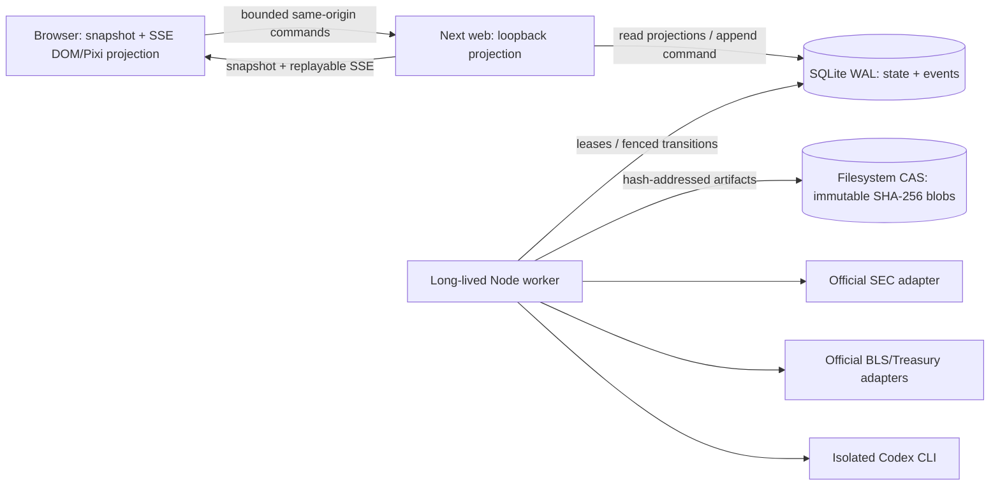

# Live Research Runtime Contract

This document is the runtime boundary for the local WorkflowV1 research service. It preserves the authored Pixi office as a projection while moving authority to durable application state.

## Process topology



The web process binds to loopback and owns request validation, local-session checks, projections, snapshot bootstrap, and SSE framing. A route handler never fetches evidence, launches Codex, executes a long job, or publishes a report. The worker owns leases, collection, snapshot sealing, schema-bound model attempts, structural/semantic audit, publication, cancellation, and restart recovery.

## Local two-process launch

Build once, choose an absolute private data directory outside `.next`, and run the two foreground processes in separate terminals:

```sh
pnpm build
STOCKSEMBLY_DATA_DIR="$PWD/.stocksembly-data" pnpm start:web
STOCKSEMBLY_DATA_DIR="$PWD/.stocksembly-data" pnpm start:worker
```

Both commands stay attached to their terminals and stop on `SIGINT` or `SIGTERM`; neither daemonizes. The web script fixes `HOSTNAME=127.0.0.1`. Worker serve, readiness, and health commands all enter through the packaged `worker.mjs` native-binding preflight. The worker creates the data root with mode `0700`, stores `research.sqlite` and immutable CAS blobs there with mode `0600`, discovers ordered migrations packaged beside the compiled worker, and refuses an occupied worker lease. `STOCKSEMBLY_DATA_DIR="$PWD/.stocksembly-data" pnpm readiness` validates native SQLite, migrations, and a CAS write; `STOCKSEMBLY_DATA_DIR="$PWD/.stocksembly-data" pnpm health` additionally requires a live worker lease. A green web process does not imply worker readiness.

## Dependency-inversion ports

| Port | Application-owned contract | Allowed adapters | Forbidden dependency direction |
|---|---|---|---|
| `ResearchStorePort` | transactional state, event sequence, lease fencing | SQLite WAL implementation | route handlers cannot call adapters directly |
| `ArtifactStorePort` | immutable bytes by SHA-256, parent links, retention metadata | filesystem CAS | callers cannot overwrite an accepted hash |
| `EvidenceSourcePort` | bounded retrieval, rights/capability, point-in-time payload | SEC, BLS, Treasury; licensed providers later | models cannot choose URLs or providers |
| `CodexPort` | schema-bound argv/stdin call, isolated attempt metadata | protected local Codex CLI | browser and route handlers cannot spawn processes |
| `RunCoordinatorPort` | WorkflowV1 phases, call ledger, cancellation, recovery | long-lived worker | elapsed animation cannot advance a phase |
| `PublicProjectionPort` | snapshot plus ordered public event projection | Next loopback web + SSE | private prompts, JSONL, stderr, and reasoning never cross |

## Durable state and recovery

SQLite runs in WAL mode with foreign keys, full synchronous commits, a busy timeout, transaction-owned event sequences, 30-second leases, 10-second heartbeats, and fencing tokens. The worker commits state transition, next job, accepted artifact metadata, and public event atomically. A restart recovers expired leases only with a higher fencing token; an SSE disconnect never cancels a run. Retry creates a child run on the verified prior snapshot. Follow-up research creates a new snapshot and child version.

The artifact store writes same-directory temporary bytes, verifies SHA-256, fsyncs the file and directory, then atomically renames an immutable 0600 blob beneath the 0700 data root. Accepted specialist, department, audit, chair, and report artifacts carry run, role, step, snapshot, and input-manifest lineage.

## Truth and publication

Every publishable run requires ten accepted specialist memos and one accepted Dr. Park synthesis. Public events are summaries of committed artifacts only. The semantic transcript and Pixi renderer consume the same canonical eight-group live mapping in `DESIGN.md` (Briefing, Evidence collection, Department analysis, Cross-team challenge, Evidence audit, Gathering, Committee, Complete); the legacy office event kinds are a separate projection seam whose tick ranges are checked against that mapping. The single 50ms office clock remains the only animation clock.

The report publishes `complete` only when mandatory evidence and all eleven accepted artifacts pass structural and semantic audit. `complete_with_limitations` discloses expected `unavailable` licensed market/consensus fields or optional macro degradation. Missing mandatory evidence, rights uncertainty, invalid artifacts, severe unsupported claims, or exhausted launch budget yields `incomplete` and never a report-looking success state.

## Contract verification

Implementation-phase verification is a bounded CLI surface:

```sh
node scripts/verify-scope-fidelity.mjs --json
```

The command first validates the immutable baseline/verifier hashes and invokes the reviewed verifier in `final` mode. Its JSON result includes the implementation phase, verifier-derived policy, canonical roster, ten beat ranges, eight transcript groups, event mapping, and topology. It accepts no caller-supplied allowlist; copied fixtures must pass the same immutable policy before contract validation.

## Machine contract

<!-- stocksembly:runtime-topology:v1 -->
```json
{
  "schema": "stocksembly.runtime-topology.v1",
  "web": "loopback-next-projection",
  "worker": "separate-long-lived-node",
  "state": "sqlite-wal",
  "artifacts": "immutable-sha256-cas",
  "stream": "snapshot-sse",
  "routeHandlersExecuteResearch": false,
  "ports": ["ResearchStorePort", "ArtifactStorePort", "EvidenceSourcePort", "CodexPort", "RunCoordinatorPort", "PublicProjectionPort"],
  "adapters": ["SEC", "BLS", "Treasury", "isolated-Codex-CLI", "loopback-Next", "snapshot-plus-SSE"],
  "persistence": { "sqliteJournal": "WAL", "artifactHash": "SHA-256", "acceptedArtifacts": 11 },
  "transcript": { "groups": 8, "clockMs": 50, "secondClock": false },
  "clients": { "snapshot": true, "sseReplay": true, "disconnectCancelsResearch": false }
}
```
