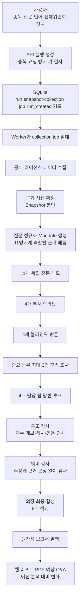

# Stocksembly 전체 에이전트 리서치 파이프라인

> 문서 기준일: 2026-07-31
> 기준 구현: `WorkflowV1`, 전체 위원회(`researchTarget.kind = "committee"`)
> 목적: 멘토·개발자·운영자가 “사용자 질문이 들어온 뒤 어떤 데이터를 받고, 어떤 검증을 거쳐, 어떻게 최종 보고서가 만들어지는지”를 코드 수준까지 이해할 수 있도록 설명한다.

## 1. 먼저 알아둘 핵심

Stocksembly의 전체 분석은 하나의 LLM에게 “이 종목 분석해 줘”라고 요청하는 단일 호출이 아니다.

현재 구현은 다음 원칙을 따른다.

1. **분석 전에 근거를 먼저 수집하고 시점을 봉인한다.**
2. **11명의 전문 에이전트가 서로의 메모를 보지 않고 독립 분석한다.**
3. **시장·기업·재무·리스크 4개 팀이 각 팀의 메모를 합의안으로 정리한다.**
4. **각 팀의 핵심 주장을 다른 팀이 작성자 신원을 가린 상태에서 반박한다.**
5. **필요한 반론만 최대 3건까지 추가 조사한다.**
6. **원 담당 팀이 반론을 수용·수정·기각하고 최종 투표한다.**
7. **구조 감사와 의미 감사를 모두 통과한 주장만 최종 합성에 사용한다.**
8. **리서치 의장은 새로 조사하지 않고, 감사된 주장·이견·투표를 편집해 보고서를 만든다.**
9. **모든 단계는 SQLite 원장과 CAS(Content Addressed Storage)에 기록되어 재시작·재시도 시 이어서 처리된다.**

제품 표현상 “11명의 AI 에이전트”는 11명의 전문 분석가를 뜻한다. 런타임에는 이들과 별도로 최종 편집을 담당하는 리서치 의장 1명이 있으므로, 캐릭터 기준으로는 **전문가 11명 + 의장 1명 = 총 12명**이다.

## 2. 전체 흐름

## 3. 실행 생성과 대기열 등록

### 3.1 사용자 입력

전체 위원회 요청에는 다음 값이 들어간다.

| 필드 | 의미 |
|---|---|
| `symbol` | 미국 주식 티커 |
| `question` | 사용자가 검증하고 싶은 투자 질문 |
| `locale` | `ko` 또는 `en` |
| `researchTarget` | 전체 분석은 `{ kind: "committee" }` |
| `Idempotency-Key` | 같은 요청의 중복 생성 방지 |

질문이 비어 있거나 유효한 투자 질문으로 정규화되지 않으면 다음 범위를 포함하는 기본 질문을 생성한다.

- 사업 경쟁력
- 성장의 지속성
- 재무 건전성
- 밸류에이션 제약
- 핵심 촉매
- 하방 위험
- 판단을 바꿀 조건

### 3.2 API가 즉시 저장하는 것

API는 한 SQLite 트랜잭션에서 다음을 만든다.

1. `runs`: 실행 ID, 스냅샷 ID, 상태, 호출 예산
2. `snapshots`: 아직 수집 중인 근거 스냅샷
3. `jobs`: `collection:initial` 작업
4. `run_events`: 첫 공개 이벤트 `run_created`
5. `research_requests`: 종목, 질문, 언어, 전체/개별팀 구분
6. `idempotency_records`: 동일 키 재요청 시 같은 실행을 돌려주기 위한 기록

활성 실행과 대기 실행 수가 정책 한도를 넘으면 새 실행을 받지 않는다. API 요청이 성공하면 사용자는 `queued` 상태의 `runId`와 `snapshotId`를 받는다.

## 4. Worker와 내구성 구조

### 4.1 웹 서버와 분석 Worker의 분리

웹 서버는 요청 접수와 조회를 담당하고, 실제 장시간 분석은 별도 Worker가 처리한다.

Worker는 데이터 디렉터리마다 단 하나만 실행될 수 있도록 `worker.lock`을 획득한다. 죽은 PID의 잠금은 회수할 수 있지만, 살아 있는 다른 Worker가 잠금을 가지고 있으면 두 번째 Worker는 시작하지 않는다.

### 4.2 저장 계층

| 저장소 | 저장 내용 |
|---|---|
| SQLite | 실행 상태, 작업, 시도, 호출 순번, 이벤트, 주장 연결, 보고서 버전 |
| 로컬 CAS | 원시 데이터, 정규화 데이터, 모델 입력·출력 산출물 |
| S3 미러(설정 시) | 로컬 CAS의 원격 보관 사본 |

CAS는 파일명이 아니라 **내용의 SHA-256 해시**로 데이터를 식별한다. 데이터가 바뀌면 해시가 바뀌므로, 나중에 원문이 조용히 교체되는 일을 탐지할 수 있다.

SQLite는 WAL 모드, 외래키 검사, `synchronous = FULL`, 5초 busy timeout으로 열린다.

### 4.3 작업 임대와 fence

Worker가 작업을 가져가면 `attempt`와 임대 토큰을 발급받는다. 결과를 저장할 때는 다음이 모두 일치해야 한다.

- 실행 ID와 스냅샷 ID
- 작업 ID와 시도 ID
- 논리 산출물 ID
- 호출 순번
- Worker 소유자 ID와 fence token
- 입력 manifest 해시
- 프롬프트·스키마 해시
- 실행 바이너리와 CLI 버전
- 도구 사용 기록 해시

따라서 오래된 Worker나 중복 실행이 뒤늦게 결과를 덮어쓰는 것을 막는다.

## 5. 초기 데이터 수집

초기 수집은 크게 SEC, 공식 거시 데이터, InsightSentry 시장·보조 데이터로 나뉜다.

### 5.1 SEC 발행사 식별

1. SEC의 ticker/exchange 기준 파일을 받는다.
2. 입력 ticker를 CIK, 법인명, 거래소에 연결한다.
3. SEC submissions를 받아 실제 공시 목록을 확인한다.
4. ticker 파일 해시와 submissions 해시를 포함한 발행사 identity hash를 만든다.

발행사 식별이 실패하거나 SEC submissions가 파싱되지 않으면 전체 분석을 계속하지 않는다.

### 5.2 선택하는 SEC 공시

현재 전체 분석은 submissions에서 다음 공시를 선택한다.

| 공시 | 선택 범위 |
|---|---:|
| 10-K | 가장 최근 1건, 필수 |
| 10-Q | 가장 최근 1건, 존재할 때 |
| 8-K | 최근 최대 2건 |
| Form 3·4·5 및 수정본 | 최근 최대 8건 |
| 13F-HR, SC 13D/G 계열 및 수정본 | 최근 최대 6건 |

선택한 공시 본문과 SEC Company Facts를 병렬로 가져온다.

각 공시에는 다음 계보 정보가 붙는다.

- accession number
- form 종류
- filed time
- SEC accepted time
- 대상 기간
- 원문 URL
- 원문 해시

내부자·기관 보유 공시는 가능한 경우 별도의 구조화된 ownership 데이터도 만든다.

### 5.3 SEC Company Facts 정규화

Company Facts/XBRL 값은 그대로 한 줄로 복사하지 않는다.

1. 10-K·10-K/A·10-Q·10-Q/A 계보를 만든다.
2. `filedAt`, `acceptedAt`, 분석 기준시각을 비교한다.
3. 기준시각 뒤에 알려진 값은 제외한다.
4. 공시 수락 시각이 비정상적인 후보도 제외한다.
5. 동일 지표의 후보 중 정책에 맞는 값을 선택한다.
6. 선택 값과 가용성 상태를 `ValueRegistry`로 정규화한다.

이 값은 이후 SEC 기준 재무 수치의 권위 있는 원장으로 사용된다.

### 5.4 공식 거시 데이터

다음 세 묶음을 병렬 수집한다.

| 데이터 | 출처 | 범위 |
|---|---|---|
| 미국 국채 수익률 곡선 | U.S. Treasury | 현재 연도의 일별 tenor 곡선 |
| CPI | BLS `CUUR0000SA0` | 현재 연도와 직전 2개 연도 |
| 실업률 | BLS `LNS14000000` | 현재 연도와 직전 2개 연도 |

현재 구현에서는 Treasury 또는 두 BLS 시리즈 중 하나라도 필수 수집에 실패하면 초기 수집을 실패 처리한다.

### 5.5 현재 시장·기술 데이터

현재 공식 파이프라인은 InsightSentry를 통해 다음을 동시에 요청한다.

- 회사 정보
- 현재 quote: 가격, 전일 변화, 변화율, 통화, 시장 상태, 관측시각
- 1시간 봉 최대 390개
- 4시간 봉 최대 390개
- 일봉 최대 1,000개

수집한 봉으로 시간대별 추세, 모멘텀, 변동성, 거래량 성격과 1시간·4시간·일봉 합치 상태를 계산한다.

현재 구현에서는 quote와 technical family를 필수 시장 데이터로 취급한다. 둘 중 하나가 없으면 `required_market_data_unavailable`로 초기 수집이 종료된다.

코드베이스에는 Alpaca 일봉 어댑터도 존재하지만, **현재 `WorkflowV1` 초기 수집 경로는 Alpaca를 실제 호출하지 않는다.** Snapshot의 adapter version 표시에 Alpaca 이름이 남아 있어도 현재 실행 데이터의 근거로 간주하면 안 된다.

### 5.6 InsightSentry 보조 데이터

| Family | 현재 상태 | 내용 |
|---|---|---|
| fundamentals | 활성 | 분기 재무·마진·현금흐름·배수·예상치 시계열 |
| news | 활성 | 회사·시장·리스크 이벤트로 분류한 뉴스 카드 |
| documents | 활성 | 문서 인덱스와 제한된 본문 |
| calendar | 활성 | 전후 일정과 보고 예정 이벤트 |
| peers | 활성 | 10-K 사업 설명을 이용한 비교기업 선택과 상대 배수 |
| options | 비활성 | 권한도 요청 필요성도 `false` |

펀더멘털은 다음과 같은 20개 시계열을 요청한다.

- 매출, 매출총이익률, 영업이익률, 순이익, 희석 EPS
- 영업현금흐름, FCF, 설비투자
- 현금·단기투자자산, 순부채
- 재고, 매출채권, 희석주식수, ROIC
- PER, EV/EBITDA, EV/Revenue
- 이익·매출 예상치

비교기업 데이터에는 직접 경쟁사와 운영 비교기업 구분, 선정 점수·이유, 시가총액, 주요 배수, 성장률, 마진, 3개월·1년 성과와 peer median 대비 premium/discount가 포함된다.

공급자 데이터는 현재 시점 자료라서 과거 PIT(Point-in-Time) 재현 자료로 가장하지 않는다. SEC와 같은 기간·단위로 비교할 수 있을 때 값이 충돌하면 SEC를 권위 있는 값으로 유지한다.

### 5.7 뉴스 분류

뉴스 원문 후보를 군집화한 뒤 다음 정보를 만든다.

- 회사·시장·리스크 카테고리
- 투자 관련성
- 긍정·부정·혼합·중립 방향
- 즉시·근기·장기 영향 시간대
- 추가 검증 필요 여부

현재 초기 수집의 뉴스 분류기는 제목·토픽 기반의 결정적 분류 로직을 사용하며, 별도의 자유형 투자 결론을 만들지 않는다.

### 5.8 요청 원장과 권리 경계

InsightSentry의 각 upstream 호출은 cache key, endpoint, URL로 request ledger에 기록된다.

라이선스 공급자 자료는 다음 두 형태로 CAS에 저장된다.

1. 원시 응답 묶음
2. 모델에 전달 가능한 정규화 데이터

각 근거에는 `rightsSource`, 조회시각, fresh-through 시각, endpoint, dataset, 단위가 붙는다. 화면과 보고서에는 재배포 가능한 정규화 결과와 출처 정보만 사용한다.

## 6. 근거 기준시각과 Snapshot 봉인

수집이 끝나면 다음 시간을 순서대로 확정한다.

1. 요청시각
2. 수집 시작시각
3. 마지막 자료 취득시각
4. evidence cutoff
5. snapshot sealed time
6. mandate sealed time

Snapshot manifest에는 다음이 포함된다.

- 발행사 identity
- 데이터·파서·계산 버전
- capability별 available/unavailable 상태
- SEC 정규화 ValueRegistry
- 데이터 수집 실패·제한
- 전체 시간 경계
- manifest hash

Snapshot이 봉인된 뒤에는 같은 실행에 새 데이터를 섞지 않는다. 이후 공시나 가격 변화는 재분석의 새 Snapshot으로만 반영한다.

## 7. 질문 정규화와 에이전트별 Mandate

시스템은 사용자의 질문을 투자 리서치 방향으로 정규화한 뒤 Snapshot manifest hash와 결합해 변경 불가능한 Mandate를 만든다.

전체 위원회에서는 11명의 전문 에이전트에게 모두 작업을 배정하지만, 각 에이전트는 자신의 역할에 필요한 근거만 받는다.

| 팀 | 에이전트 | 주요 검증 영역 | 대표적인 입력 근거 |
|---|---|---|---|
| 시장 | Maya | 금리·물가·고용·시장 환경 | SEC, CPI, 실업률, 국채곡선 |
| 시장 | June | 가격 구조·기술 흐름 | 1h·4h·1d 봉, quote, provider coverage |
| 시장 | Alex | 비교기업·상대 밸류에이션 | peers, fundamentals, 기술 데이터, 국채 |
| 기업 | Ethan | 사업모델·경쟁력 | 10-K·10-Q·8-K·뉴스 |
| 기업 | Aria | 제품·채택·수요 | 주요 공시·8-K·뉴스 |
| 기업 | Leo | 경쟁사·해자 | 공시, capability 상태 |
| 재무 | Noah | 실적·현금흐름 | 공시·Company Facts·수정 계보 |
| 재무 | Sofia | 밸류에이션 | Company Facts·공시·provider fundamentals |
| 재무 | Hana | 회계 품질 | 공시·Company Facts·수정 계보 |
| 리스크 | Liam | 복합 하방·운영 위험 | 공시·8-K·거시·뉴스 |
| 리스크 | Min | 정책·규제 위험 | 공시·8-K·물가·고용·국채 |

의장은 이 단계에서 조사 작업을 받지 않는다. 의장은 모든 검증이 끝난 뒤 감사된 결과만 받는다.

## 8. 11명 독립 전문 메모

### 8.1 독립성

각 전문가는 다른 전문가의 결과를 보기 전에 자기 메모를 만든다. 논리 산출물 ID는 `memo:{roleId}` 형식이다.

### 8.2 모델이 받는 것

- 사용자 질문과 언어
- 담당 역할과 분석 범위
- 해당 역할에 허용된 Snapshot 근거
- capability 가용성
- 인용 가능한 artifact ID
- JSON 출력 스키마

메모 단계만 `audited_web`이 허용된다. 웹을 사용한 경우 URL·제목·게시자·조회시각·발췌·원문 해시와 도구 전사가 해당 attempt에 묶인다. 해당 attempt가 실제로 캡처하지 않은 웹 근거는 결과 인용으로 커밋할 수 없다.

### 8.3 메모 출력

각 메모는 자유 형식 글이 아니라 다음 구조의 JSON이다.

- `sourceArtifactIds`
- `positions` 1~32개
  - claim ID
  - 공개 요약
  - 지지·반대·불확실 stance
  - 연결 evidence artifact ID
- `dissent`
- `unknowns`

모델 출력은 스키마, 인용 범위, 역할 소유권, 입력 manifest, 실행 증거를 모두 통과해야 `specialist_memo_committed`가 된다.

## 9. 4개 팀 내부 합의

각 팀장이 자기 팀원들의 인증된 메모만 받아 `consolidation:{department}`를 만든다.

| 팀 | 합치는 메모 |
|---|---|
| 시장 | Maya, June, Alex |
| 기업 | Ethan, Aria, Leo |
| 재무 | Noah, Sofia, Hana |
| 리스크 | Liam, Min |

합의안에는 다음이 들어간다.

- 합의된 claim ID
- 충돌하는 claim ID
- 최종 수용 claim
- 가장 강한 주장과 가장 약한 주장
- 수정한 주장과 제거한 주장
- 팀 공개 요약
- 보존할 소수 의견
- 아직 답하지 못한 질문
- 우선순위가 높은 근거 artifact

이 단계부터는 외부 검색을 하지 않는다. 봉인된 전문 메모와 근거만 사용한다.

## 10. 팀 간 블라인드 반론

반론 관계는 고정되어 있다.

| 반론 주체 | 검증 대상 | 검증 범위 |
|---|---|---|
| 시장 팀 | 재무 팀 | 재무 시나리오 가정 |
| 기업 팀 | 리스크 팀 | 위험의 심각도와 사업 영향 |
| 재무 팀 | 기업 팀 | 사업·운영 근거 주장 |
| 리스크 팀 | 시장 팀 | 시장·거시·운영·밸류에이션 해석 |

### 10.1 반론 대상 선택

시스템은 대상 팀 합의안의 strongest claim을 우선 선택한다. 반대 후보는 다음 순서로 찾는다.

1. stance가 `opposes` 또는 `uncertain`
2. 팀 합의에서 disagreement·weakest·revised·removed로 분류
3. 주 주장과 다른 근거를 가진 후보
4. 그래도 없으면 다른 주장 하나

### 10.2 블라인드 안전성

반론 프롬프트에는 작성자 이름과 인격적 표현을 제거하고 다음만 보낸다.

- 대상 주장과 공개 요약
- 대상 주장의 근거
- 반대 주장과 반대 근거
- 검증할 범위

인물 이름, 직책 귀속, 모욕적 표현이 남으면 blind-safe 검사를 통과하지 못한다.

### 10.3 반론 출력

- 대상 claim ID 1개
- 공개 반론
- 반론 근거
- `direct`, `partial`, `not_established` 모순 분류
- `material`, `supporting` 중요도
- 필요한 경우 후속 요청
  - 출처 범위 재확인
  - 계산 재검산
  - 판단 전환 조건 확인

## 11. 선택적 후속 조사

모든 반론을 다시 조사하지 않는다. 반론의 중요도와 미해결 정도를 순위화해 최대 3개의 `followup:{department}`만 만든다.

후속 조사 결과에는 다음이 포함된다.

- 원 follow-up request ID
- 공개 답변
- 사용한 근거
- 아직 해소되지 않은 조건

후속 조사도 봉인된 입력만 사용하며 외부 도구 호출은 금지된다.

## 12. 원 담당 팀의 답변과 투표

후속 조사가 끝났거나 필요하지 않은 팀부터 `response_ballot:{department}`를 만든다.

각 팀은 반론 대상 claim마다 다음 중 하나를 선택한다.

- `accept`: 반론을 수용
- `revise`: 기존 주장을 수정
- `reject`: 근거를 들어 반론을 기각

그 뒤 팀의 최종 투표를 제출한다.

- `support`
- `support_with_reservations`
- `oppose`
- `abstain`

최종 팀 출력에는 claim별 처리 이유, 투표 근거 claim, 보존 이견, 미해결 조건이 포함된다.

위원회 합의 상태는 별도 자유형 모델이 아니라 4개 투표로 결정한다.

- 반대 2표 이상: `oppose`
- 지지 3표 이상: `support`
- 전원 기권: `abstain`
- 나머지: `support_with_reservations`

## 13. 구조 감사

구조 감사는 LLM 호출이 아니라 결정적 코드 검사다.

### 13.1 필수 산출물 개수 검사

- 전문 메모 11개
- 팀 합의안 4개
- 블라인드 반론 4개
- 담당 팀 답변·투표 4개

각 논리 산출물 ID가 정확히 한 번 존재하고, 올바른 run·snapshot에 속해야 한다.

### 13.2 인증과 무결성 검사

- accepted artifact가 CAS에 실제 존재하는가
- DB content hash와 CAS bytes가 일치하는가
- 인용 locator hash가 일치하는가
- 근거가 다른 run 또는 snapshot에서 섞이지 않았는가
- 웹 근거가 해당 attempt의 fenced tool transcript와 연결되는가
- 전문 주장마다 실제 evidence link가 하나 이상 있는가
- dissent와 open question이 중간 단계에서 유실되지 않았는가

### 13.3 구조화된 감사 입력

감사 단계에서 각 전문 메모의 position을 원자 주장으로 바꾸고 다음을 붙인다.

- positive·caution·mixed stance
- materiality
- supporting evidence
- 기준시각
- freshness
- uncertainty
- 판단 변경 조건

가격·provider fundamentals·peer 데이터가 있으면 별도의 metric snapshot도 만든다.

구조 감사가 publishable하지 않거나 필수 artifact set이 불완전하면 이후 단계로 진행하지 않는다.

## 14. 의미 감사

구조가 맞는다고 내용까지 맞는 것은 아니므로 두 번째로 의미 감사를 수행한다.

### 14.1 모델이 받는 것

- 구조 감사 hash
- claim ID와 중요도
- claim 본문
- 각 claim에 연결된 정확한 근거 구간
- supporting·opposing 관계
- 보존된 open question

근거 구간에는 artifact ID, source, 조회시각, available time, locator hash, 시작·끝 offset, text hash, 정확한 원문이 포함된다. 원문 구간의 길이와 hash가 다르면 의미 감사 전에 차단된다.

### 14.2 판정

각 claim을 다음 중 하나로 판정한다.

- `entailed`: 근거가 주장을 뒷받침
- `partial`: 일부만 뒷받침
- `contradicted`: 근거와 충돌
- `not_assessable`: 현재 근거로 판단 불가

모순 강도도 `none`, `limited`, `severe`로 기록한다. open question은 `covered`, `partial`, `uncovered`로 분류한다.

의미 감사 모델은 검색·파일 읽기·도구 호출을 할 수 없다. 요청 안에 들어 있는 봉인된 문장만 판단한다.

## 15. 리서치 의장 최종 합성

의장은 새 사실을 찾는 분석가가 아니라 감사된 결과를 최종 투자 문서로 편집하는 역할이다.

### 15.1 의장 입력

- 사용자 질문과 locale
- capability 가용성 및 제한
- 의미 감사를 통과한 claim
- 4개 팀 합의안
- 4개 팀 투표
- 보존된 dissent
- unresolved question
- 운영 시나리오
- 판단 변경 조건
- 인용 가능한 source artifact

### 15.2 6개 필수 섹션

1. `ten_second_brief`: 질문에 대한 직접 결론
2. `supported_analysis`: 사업·수요·제품·실적·마진·현금전환
3. `valuation_comparison`: 가격·배수·기대·peer·benchmark 비교
4. `operational_scenarios`: 서로 다른 운영 시나리오
5. `dissent_unknowns`: 결론을 바꿀 반대 근거와 미확인 사항
6. `change_conditions`: 판단이 바뀌는 관측 가능한 조건

같은 결론 문장을 여러 섹션에서 반복할 수 없도록 역할을 분리한다. 비교기업 근거가 있으면 직접 경쟁사와 운영 비교기업을 나누고, peer median과 대상 기업의 premium/discount, 성장·마진이 차이를 정당화하는지를 설명해야 한다.

의장 단계의 reasoning 설정은 `low`이며 외부 검색은 금지된다.

## 16. 보고서 조립과 발행

### 16.1 발행 전 마지막 검사

- 구조 감사가 publishable인가
- 모든 감사 metric이 분모만큼 통과했는가
- 의미 감사와 구조 감사의 run·snapshot·version 계보가 같은가
- 의장 섹션이 정확히 6개인가
- 의장이 인용한 sentence와 claim이 감사 집합 안에 있는가
- dissent와 open question이 빠지지 않았는가
- scenario가 수치 또는 인증된 문장에서 복원 가능한가
- source register가 유효한가

`contradicted` claim은 최종 핵심 주장 목록에서 제외한다. `partial`과 `not_assessable`은 제한 사항으로 남긴다.

### 16.2 최종 보고서 데이터

- report·version·run·snapshot ID
- `complete` 또는 `complete_with_limitations`
- 사용자의 research direction
- 현재 시장 snapshot
- 재무·가격·peer metric snapshot
- 4개 팀 입장과 투표
- 6개 의장 섹션
- 감사된 claim register
- source register
- 데이터 coverage
- SEC와 provider 값 불일치 기록
- 감사 metrics
- limitations
- 시나리오
- dissent와 open question

### 16.3 원자적 발행

보고서 CAS 저장, report version 저장, run 상태 변경, `report_published` 이벤트 기록은 하나의 권위 있는 발행 경계에서 처리된다.

의장 artifact와 fence가 바뀌었거나 run version이 예상과 다르면 발행하지 않는다. 따라서 화면에 보고서가 보인다는 것은 단순히 모델 응답이 끝났다는 뜻이 아니라, 마지막 권위 검사를 통과해 발행 트랜잭션이 완료됐다는 뜻이다.

## 17. 이전 분석 대비 변화와 예상 Q&A

### 17.1 이전 분석 대비 변화

같은 종목·같은 분석 종류의 직전 발행 보고서를 찾아 다음을 저장한다.

- prior version ID
- 새로 추가된 claim ID
- 제거된 claim ID

화면에서는 이 claim 변화와 최신 metric snapshot을 이용해 “어떤 데이터가 바뀌었고, 결론에 어떤 영향을 줬는지”를 보여준다.

### 17.2 예상 Q&A

예상 Q&A 10개는 별도의 메인 파이프라인 모델 호출이 아니다. 발행된 보고서의 다음 요소를 재조합해 만든다.

- 의장 thesis와 valuation
- 긍정·우려
- 판단 변경 조건
- 다음 이벤트
- 4개 팀 입장과 근거
- 실제 metric snapshot

따라서 Q&A는 보고서 밖의 새 사실을 만들지 않고, 보고서를 투자자가 실제로 묻는 질문 형태로 다시 읽게 하는 presentation layer다.

## 18. 모델·도구 정책

| 단계 | 기본 모델 | reasoning | 웹 |
|---|---|---|---|
| 전문 메모 | `gpt-5.6-terra` | medium | audited web |
| 팀 합의 | `gpt-5.6-terra` | medium | 금지 |
| 블라인드 반론 | `gpt-5.6-terra` | medium | 금지 |
| 후속 조사 | `gpt-5.6-terra` | medium | 금지 |
| 담당 팀 답변·투표 | `gpt-5.6-terra` | medium | 금지 |
| 의미 감사 | `gpt-5.6-terra` | medium | 금지 |
| 의장 합성 | `gpt-5.6-terra` | low | 금지 |

환경 플래그 `STOCKSEMBLY_LUNA_SUPPORT_SPECIALISTS=1`이 켜져 있으면 일부 보조 전문 메모만 `gpt-5.6-luna` low로 전환할 수 있다. 기본값은 terra다.

모델 프로세스는 ephemeral·read-only sandbox로 실행하며 앱, 컴퓨터 사용, 멀티에이전트, 셸 등 리서치에 필요 없는 기능을 비활성화한다.

## 19. 호출 예산과 실패 처리

### 19.1 호출 예산

| 항목 | 한도 |
|---|---:|
| 초기 데이터 수집 | 1회 |
| 필수 모델 첫 시도 | 25회 |
| 선택 후속 조사 | 최대 3회 |
| 필수 산출물 대체 재시도 | 최대 5회 |
| 전체 물리 모델 실행 | 최대 34회 |

필수 첫 시도 25회는 다음과 같다.

- 전문 메모 11
- 팀 합의 4
- 블라인드 반론 4
- 담당 팀 답변·투표 4
- 의미 감사 1
- 의장 합성 1

구조 감사는 결정적 코드이므로 모델 호출 예산에 포함되지 않는다.

### 19.2 실패 처리

- 스키마 불일치: 해당 산출물 실패
- 필수 산출물 첫 실패: 예산 안에서 대체 시도
- 같은 필수 산출물의 반복 실패: `replacement_exhausted`
- 시점·해시·계보 불일치: 발행 차단
- 외부 공급자 필수 데이터 실패: 초기 수집 실패
- Worker 중단: 확정된 마지막 SQLite/CAS 상태부터 재개
- 취소 요청: 새 작업을 막고 실행 중 경계를 닫은 뒤 취소 확정

모델 활동이 계속되는 동안에는 고정 180초 제한으로 끊지 않는다. 10분 동안 JSONL·프로세스 활동이 없을 때 hang으로 판단한다.

## 20. 공개 회의록에 보이는 이벤트

내부 DB 상태 전체를 그대로 노출하지 않고, 다음 공개 이벤트를 순서대로 전달한다.

1. `run_created`
2. `collection_started`
3. `evidence_cutoff_recorded`
4. `snapshot_sealed`
5. `mandate_sealed`
6. `specialist_memo_committed` × 11
7. `department_consolidation_committed` × 4
8. `challenge_committed` × 4
9. 필요한 경우 `followup_committed` × 0~3
10. `owner_response_committed` × 4
11. `department_ballot_committed` 또는 ballot projection
12. `structural_audit_completed`
13. `semantic_audit_committed`
14. `gathering_started`
15. `committee_classified`
16. `chair_synthesis_committed`
17. `report_published`

복구 중에는 `runtime_status`, 실패·취소 시에는 별도의 terminal event가 추가될 수 있다.

## 21. 2026-07-31 로컬 실제 실행 확인

문서 작성 중 로컬 Worker에 전체 위원회 분석을 실제로 1건 생성했다.

| 항목 | 값 |
|---|---|
| 종목 | NVDA |
| 실행 ID | `8fe2278f-6e06-4939-bb20-cb6c31f0ba48` |
| 스냅샷 ID | `d76a3239-8261-4c82-be25-605983ff76eb` |
| 생성시각 | `2026-07-31T07:18:50.602Z` |
| 실행 종류 | 전체 위원회 |
| 언어 | 한국어 |

실제 관찰된 흐름:

1. API가 `queued`, event sequence 1로 실행 생성
2. Worker가 실행을 `running`으로 전환
3. 약 10초 안에 데이터 수집·시점 확정·Snapshot 봉인·Mandate 배정까지 진행
4. 11개 전문 메모가 병렬로 생성·커밋
5. 4개 팀 통합 의견 생성
6. 4개 교차 반론 생성
7. 최대 허용치인 3개 후속 조사 수행
8. 4개 팀 책임자의 최종 응답 생성
9. 구조 감사 완료
10. 의미 감사 입력 검증에서 중단

### 실측 결과

| 항목 | 값 |
|---|---|
| 종료 상태 | `incomplete` |
| 마지막 event sequence | 64 |
| 시작 시각 | `2026-07-31T07:18:50.602Z` |
| 종료 시각 | `2026-07-31T07:22:02.569Z` |
| 소요 시간 | 약 3분 12초 |
| 종료 코드 | `semantic_audit:evidence_content_mismatch` |
| 리포트 발행 | 안 됨 |

단계별 공개 이벤트 수:

| 이벤트 | 개수 |
|---|---:|
| `run_created` | 1 |
| `collection_started` | 1 |
| `evidence_cutoff_recorded` | 1 |
| `snapshot_sealed` | 1 |
| `mandate_sealed` | 1 |
| `specialist_memo_committed` | 11 |
| `department_consolidation_committed` | 4 |
| `challenge_committed` | 4 |
| `followup_committed` | 3 |
| `owner_response_committed` | 4 |
| `structural_audit_completed` | 1 |
| `runtime_status` | 1 |
| `run_incomplete` | 1 |

이번 실행은 외부 데이터 수집이나 에이전트 토론에서 실패한 것이 아니다. 구조 감사가 11개 claim과 40개 source를 연결한 뒤, 의미 감사에 전달한 근거 내용이 봉인된 원문과 정확히 일치하는지 확인하는 결정적 검증에서 `evidence_content_mismatch`가 발생했다. 시스템은 이 상태에서 불완전한 근거를 억지로 사용하지 않고 발행을 차단했다.

따라서 이 실측은 두 가지를 보여준다.

- 수집 → 11개 전문 분석 → 4개 팀 통합 → 교차 반론 → 후속 조사 → 팀 응답 → 구조 감사까지의 실행 경로는 실제로 작동했다.
- 현재 로컬 빌드에는 의미 감사 입력의 근거 내용 정합성을 보완해야 하는 미해결 지점이 있으며, 이 실행에서는 최종 의장 합성과 리포트 발행까지 도달하지 못했다.

## 22. 구현 근거 파일

### 실행·저장·Worker

- `src/research/server/api/researchApiRepository.ts`
- `src/research/worker/runtimeLifecycle.ts`
- `src/research/compositions/officialWorker.ts`
- `src/research/compositions/officialWorkflowCoordinator.ts`

### 데이터 수집

- `src/research/compositions/initialCollectionHandler.ts`
- `src/research/compositions/initialCollectionData.ts`
- `src/research/compositions/insightSentryInitialCollection.ts`
- `src/research/server/data/sec/`
- `src/research/server/data/macro/`
- `src/research/server/data/insightsentry/`

### 에이전트·토론

- `src/research/domain/roleRegistry.ts`
- `src/research/domain/roleRegistryData.ts`
- `src/research/domain/roleRegistryArtifacts.ts`
- `src/research/domain/agentOutputs.ts`
- `src/research/workflow/specialistRound*`
- `src/research/workflow/departmentRound*`
- `src/research/workflow/challengeRound*`
- `src/research/workflow/followupAndResponseRound*`

### 감사·합성·발행

- `src/research/compositions/officialStructuralAuditInput.ts`
- `src/research/workflow/structuralAuditPersistence.ts`
- `src/research/workflow/semanticAudit*`
- `src/research/workflow/chairSynthesis*`
- `src/research/application/assembleReport.ts`
- `src/research/server/persistence/sqlite/publishAuthoritativeReportForRun.ts`
