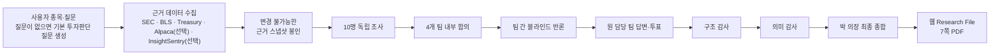

# SERN 리서치 시스템 안내

이 문서는 현재 코드가 실제로 수집하는 데이터, 각 에이전트의 역할, 조사·토론·감사·보고서 생성 방식을 운영자 관점에서 설명합니다. “향후 계획”이 아니라 현재 구현 기준입니다.

## 한눈에 보는 전체 흐름

## 실제로 사용하는 데이터

| 데이터 | 출처 | 현재 수집 범위 | 주로 답하는 질문 |
|---|---|---|---|
| 기업 식별정보 | 미국 SEC ticker/exchange 파일과 submissions | 요청 시점 최신 CIK, 법인명, 거래소, ticker | 올바른 발행사를 분석하는가 |
| 연차 공시 | 미국 SEC EDGAR | 가장 최근 10-K 1건 | 사업 구조, 경쟁, 고객 집중, 장기 위험, 연간 재무 |
| 분기 공시 | 미국 SEC EDGAR | 가장 최근 10-Q 1건, 존재할 때 | 최근 성장·마진·현금흐름 변화 |
| 중요 현안 | 미국 SEC EDGAR | 가장 최근 8-K 최대 2건 | 최근 실적·계약·경영 이벤트 등 공식 업데이트 |
| 정규화 재무값 | SEC Company Facts/XBRL | 10-K·10-K/A·10-Q·10-Q/A 계보에서 공시 시점상 유효한 최신 값 선택 | 매출, 이익, 현금흐름 등 수치 검증 |
| 내부자 거래 | 미국 SEC Form 3·4·5 | 최근 공시 최대 8건을 거래유형·수량·가격·보유량으로 구조화 | 경영진의 실제 매수·매도와 보상·행사·세금 거래 구분 |
| 주요주주 공시 | 미국 SEC Schedule 13D·13G | 대상 기업에 대해 제3자가 제출한 최근 공시 최대 6건 | 5% 이상 주요주주의 보유·의결권·처분권 변화 |
| 소비자물가 | 미국 BLS `CUUR0000SA0` | 현재 연도와 직전 2개 연도 | 물가·금리 환경 |
| 근원 소비자물가 | 미국 BLS `CUUR0000SA0L1E` | 현재 연도와 직전 2개 연도 | 일시적 품목을 제외한 물가 압력 |
| 실업률 | 미국 BLS `LNS14000000` | 현재 연도와 직전 2개 연도 | 경기·고용 환경 |
| 비농업 고용 | 미국 BLS `CES0000000001` | 현재 연도와 직전 2개 연도 | 고용 수요와 경기 방향 |
| 시간당 평균임금 | 미국 BLS `CES0500000003` | 현재 연도와 직전 2개 연도 | 임금·서비스 물가 압력 |
| 최종수요 생산자물가 | 미국 BLS `WPUFD4` | 현재 연도와 직전 2개 연도 | 기업 원가·가격전가 환경 |
| 국채 금리곡선 | 미국 재무부 | 현재 달력연도의 일별 곡선, 그중 최신 관측 | 할인율·금리 환경 |
| 주가·거래량 | Alpaca Market Data, API 키 설정 시 | 최근 3년 조정 일봉, 최대 약 750거래일 | 현재 종가, 추세, 모멘텀, 변동성, 거래량 확인 |
| 기술지표 | 위 조정 일봉을 SERN이 로컬 계산 | SMA 20·50·200, RSI 14, MACD 12·26·9, ATR 14, 볼린저 20·2, 20일 거래량 비율, 1·3·6·12개월 수익률, 52주 고저점 거리 | 한 지표가 아니라 추세·모멘텀·변동성·거래량의 합치 여부 |
| 시세·1시간/4시간 봉 | InsightSentry via RapidAPI, 구독 키 설정 시 | quote 1회와 1시간·4시간 각 390봉 요청, 실제 관측 시작·종료·봉 수를 보고서에 표시 | 단기·중기 추세의 합치와 진입 무효화 조건 |
| 펀더멘털·뉴스·문서·일정 | InsightSentry via RapidAPI, 구독·권한 범위 안에서 | 펀더멘털 최대 60개 지표, 시계열 최대 20개 지표/12~20기간, 뉴스 최대 2회·20개 이벤트·8개 발췌, 문서 인덱스 1회·본문 최대 3건, 일정 ±90일 | 공식 공시를 보조하는 최신 맥락과 확인 대상 |
| 캡처된 공개 웹 | OpenAI 호스팅 웹 검색 경계 | 허용된 모델 단계가 실제 인용한 URL·제목·게시자·검색 시각·제한된 발췌만 CAS에 저장 | 공급자 자료에 없는 최신 공개 사실의 보조 확인 |

모든 자료는 요청 시각 뒤 정해진 `evidence cutoff` 이전에 받은 것만 사용합니다. 이후 새 공시가 나와도 진행 중인 리서치에는 섞지 않고, 재분석 시 새 스냅샷을 만듭니다. 각 근거는 원문 해시, 접근 시각, 공시 수락 시각, accession을 함께 보존합니다.

### 시장 데이터와 InsightSentry 설정

`APCA_API_KEY_ID`, `APCA_API_SECRET_KEY`가 있으면 조정 일봉과 파생 기술지표가 스냅샷에 들어갑니다. 키가 없거나 공급자가 실패하면 에이전트가 수치를 추측하지 않고 `licensed_market_data_not_configured` 제한을 남깁니다. 원시 시세의 외부 재배포는 하지 않고 로컬 근거와 파생 지표만 사용합니다.

`INSIGHTSENTRY_RAPIDAPI_KEY`와 `INSIGHTSENTRY_RAPIDAPI_HOST=insightsentry.p.rapidapi.com` 설정이 유효하면 공급자 자료를 추가합니다. 권한이 없거나 관측된 `403`이 반환되면 재시도하지 않고 `subscription_required` 또는 해당 endpoint-family 제한을 남긴 채 보고서를 계속 발행합니다. `401`은 인증 오류, `429`와 `5xx`/네트워크 오류는 내구성 있는 재시도 대기, 스키마·권리·출처 오류는 운영자 확인 필요 상태로 구분합니다. 보고서에는 endpoint family별 `available`, `stale`, `unavailable`, `withheld_by_rights`, 실제 관측 기간과 건수, 제한 코드를 표시합니다.

공급자 펀더멘털은 현재 시점 자료이며 과거 시점 재현(PIT) 자료로 사용하지 않습니다. 같은 기간·단위·통화의 SEC Company Facts와 값이 다르면 차이를 공개하되 SEC 값을 기준으로 유지합니다. 공급자 원문과 웹 원문은 권리 정책을 통과한 제한 발췌만 모델·화면·파일 내보내기에 사용하며, 원시 라이선스 응답은 재배포하지 않습니다.

현재 설계상 한 보고서의 InsightSentry 고유 upstream 요청 배분은 다음과 같습니다. 실제 수는 실행별 request ledger에 기록됩니다.

| 구분 | 정확한 배분 | 합계 |
|---|---|---:|
| 콜드 실행 | symbol search 보통 0, company info 0~1, quote 1, OHLCV 2, fundamentals snapshot 0~1, fundamentals series 0~4, news 1~2, document index/body 0~3, calendar 0~1, peers 0~1, options 0~2 | 보통 9~13 |
| 웜 실행 | 캐시된 symbol/info/fundamentals를 재사용하고 quote 1, OHLCV 0~2, 갱신이 필요한 fundamentals/news/documents/calendar만 호출 | 보통 4~7 |

초기 한 번의 교정 결과는 8개 endpoint 모두 `200`, 월 한도 50,000, 일봉 756개, 시간봉 390개, 펀더멘털 1,163개, 뉴스 50개, 문서 행 306개였습니다. 이 수치는 요청 계약을 바꾸지 않는 한 다시 교정하지 않으며, 보고서의 실제 범위는 각 실행의 ledger와 관측 기간을 따릅니다.

애널리스트 컨센서스와 공매도 데이터는 현재 연결되어 있지 않습니다. 옵션은 권한이 있고 분석에 필요할 때만 호출합니다. 따라서 다음은 보고서에서 만들지 않습니다.

- BUY·SELL 같은 직접 매매 지시
- 애널리스트 평균 목표가나 등급 변화
- 옵션 내재변동성이나 공식 공매도 신호

시장 데이터가 있으면 소피아가 SEC 재무값과 현재 종가를 함께 사용해 배수와 조건부 가치평가를 검토할 수 있습니다. 다만 공급자 이용권은 별도 계약 사항이므로 공개 상용 서비스의 시세 표시·재배포 전에는 Alpaca의 해당 라이선스를 확인해야 합니다.

## 11명의 역할

| 팀 | 에이전트 | 책임 |
|---|---|---|
| 시장 | Maya | 금리·물가·고용, 주가 국면이 투자환경에 주는 영향 |
| 기술 | June | InsightSentry 1시간·4시간 구조의 추세·모멘텀·RSI·MACD·ATR·거래량·지지/저항·무효화 수준과 시간대 간 합치 확인. 밸류에이션은 맡지 않으며 내부 호환 ID `market_news`는 유지 |
| 기업 | Ethan, Aria, Leo | 사업모델, 제품 경쟁력, 고객 채택, 경쟁 구도와 해자 |
| 재무 | Noah, Hana | 성장·마진·현금흐름, 수치 일관성, 회계 품질 |
| 가치평가 | Sofia | SEC 기준 재무값과 허용된 시장 종가를 연결한 배수·이익 시나리오. 차트 판단과 직접 매매 지시는 금지 |
| 리스크 | Liam, Min | 고객 집중, 공급망, 정책·수출통제, 운영 하방과 판단 변경 조건 |
| 의장 | Dr. Park | 조사 지시가 아니라 감사된 주장·팀 투표·이견을 편집해 최종 판단을 작성 |

각 전문 에이전트는 자기 역할에 허용된 근거 묶음만 받습니다. 사용자가 질문을 비우면 시스템이 “사업 경쟁력, 성장 지속성, 재무 건전성, 밸류에이션 제약, 촉매, 하방 위험, 판단 변경 조건”을 묻는 기본 투자판단 질문을 자동으로 만듭니다.

모델은 모든 단계에서 `gpt-5.6-terra`를 사용하며 추론 강도는 모두 `medium`입니다. 메모·부서 통합·블라인드 반론·담당자 답변 투표·후속 조사는 `audited_web`, 의미 감사·의장 종합·QA·프로브는 `disabled`입니다. 실행 시 모델, 추론 강도, 브라우징 정책, 도구 전사 해시를 시작 증거와 SQLite에 기록하고, 예약된 정책과 다른 증거는 결과 커밋·게시 전에 거부합니다.

웹 검색은 OpenAI의 호스팅 Responses 경계를 신뢰하는 방식입니다. 로컬 시스템이 원격 DNS나 redirect를 직접 통제한다고 주장하지 않습니다. 대신 로컬 child process의 임의 egress를 막고 인증된 OpenAI 전송 프록시만 허용하며, 허용된 search/open 이벤트의 URL·제목·게시자·시각·제한 발췌·해시만 CAS와 attempt ledger에 저장합니다. 해당 attempt에 캡처되지 않은 인용은 커밋할 수 없고, 의장과 감사 단계는 검색 도구 없이 봉인된 근거만 읽습니다.

활동 중인 모델에는 180초 총시간 제한을 두지 않습니다. JSONL 또는 process 활동이 계속되면 lease heartbeat가 이어지고, 10분 동안 활동이 없을 때만 hang으로 회수합니다. 취소가 항상 우선하며, transient 오류는 지수 backoff·jitter를 적용한 `retry-wait`, 반복 transient 오류는 복구 가능한 circuit/운영자 확인, 영구 인증·권리·스키마 오류는 `attention-required` 또는 제한 포함 완료로 남습니다. 프로세스 재시작 뒤에도 이 상태와 기존 실패 기록을 이어서 처리합니다.

## 조사와 토론은 어떻게 진행되는가

### 1. 독립 조사

11명이 동시에 같은 문장을 생성하는 방식이 아닙니다. 각자는 서로의 메모를 보기 전에 담당 근거에서 다음을 제출합니다.

- 핵심 주장과 지지·반대·불확실 입장
- 주장에 연결된 정확한 근거 artifact
- 반대 근거
- 불확실성
- 판단을 바꿀 조건
- 추가로 확인해야 할 질문

### 2. 팀 내부 합의

시장·기업·재무·리스크 네 팀이 각 팀원의 메모를 합칩니다. 강한 주장, 약한 주장, 수정할 주장, 제거할 주장, 해소되지 않은 질문을 분리합니다.

### 3. 팀 간 블라인드 반론

사람 이름이나 권위에 기대지 않도록 상대 작성자 신원을 가리고 주장과 근거만 보여줍니다.

| 반론 팀 | 검증 대상 |
|---|---|
| 시장 팀 | 재무 팀의 시나리오 가정 |
| 기업 팀 | 리스크 팀의 위험 심각도와 사업 영향 |
| 재무 팀 | 기업 팀의 사업·운영 주장 |
| 리스크 팀 | 시장 팀의 거시·운영·밸류에이션 해석 |

반론은 직접 모순, 부분 모순, 모순 불성립으로 분류됩니다. 추가 근거가 필요하면 계산 재확인, 출처 범위 확인, 변경 조건 확인 중 하나를 요청합니다.

후속 검증 에이전트에는 주장 ID만 넘기지 않습니다. 검토 대상 주장 본문, 반론 요약, 담당 부서의 기존 주장·이견·미확인 사항을 함께 전달해 “주장 문구가 없다”는 식의 빈 응답을 막습니다.

### 4. 원 담당 팀의 답변과 투표

원 담당 팀은 반론을 `수용`, `수정`, `기각` 중 하나로 처리하고 이유를 공개합니다. 그 뒤 최종 의견을 지지, 유보부 지지, 반대, 기권으로 투표합니다. 해소되지 않은 이견은 삭제하지 않고 보고서에 보존합니다.

### 5. 이중 감사와 최종 합성

- 구조 감사: 모든 중요한 주장에 실제 근거가 연결됐는지, 시점과 출처 계보가 맞는지 검사합니다.
- 의미 감사: 근거 원문이 주장 문장을 실제로 뒷받침하는지 검사합니다. 긴 공시는 첫 부분을 기계적으로 자르지 않고, 주장 속 수치·제품·위험 키워드가 가장 밀집된 원문 구간을 선택해 검증합니다.
- 의장 종합: 두 감사를 통과한 주장, 4개 팀 입장·투표, 보존된 이견, 변경 조건만 이용합니다.

10초 요약은 회사 소개가 아니라 `판단 방향 + 가장 강한 근거 + 결정적 위험 또는 조건`을 한 문장으로 작성합니다. 본사 소재지, 상장시장, 일반적인 사업 설명으로 시작하지 못하게 제한했습니다.

## 화면에서 보이는 표시

오른쪽 회의록은 모든 이벤트를 처음부터 보존하고 다음 여섯 종류로 구분합니다.

1. 근거 준비
2. 개별 조사
3. 팀 합의
4. 팀 간 반론
5. 근거 감사
6. 최종 위원회

중앙 말풍선은 현재 이벤트의 실제 담당 캐릭터 좌표에 붙습니다. 팀 토론·반론 단계에서는 해당 대표가 상대 대표 쪽을 바라보며, 최종 위원회에서는 발언자와 의장이 서로 마주 봅니다. 구조 감사 뒤에는 의미 검증, 위원회 준비, 의장 편집, 보고서 발행 중 중 무엇을 하고 있는지 별도로 표시합니다.

긴 발언은 58자 이하의 짧은 말풍선으로 나눠 약 2.4초마다 이어서 보여줍니다. 새 커밋이 도착해 목표 장면이 바뀌어도 시뮬레이션을 처음부터 다시 만들지 않고, 기존 좌표에서 충돌 예약 경로를 따라 걷습니다. 진행 격차가 큰 경우에만 애니메이션 시간을 최대 4배로 재생해 화면이 지나치게 뒤처지는 것을 막습니다.

## 최종 보고서의 읽는 순서

웹과 PDF 모두 다음 순서로 설계했습니다.

1. 근거 판단, 감사 통과 수, 주장 수, 출처 수
2. 한 문장의 10초 투자판단
3. 핵심 긍정과 핵심 우려
4. 운영 현실과 시나리오
5. 판단이 바뀌는 조건
6. 팀 토론과 보존된 이견
7. 근거 목록, 데이터 한계, 방법론

PDF는 7쪽입니다. 타 서비스의 “점수·핵심 논지·실적·밸류에이션·리스크·결론” 정보 위계를 참고했지만, 가격 데이터가 없는 상태에서 목표가나 상승여력을 만들어내지 않고 SERN의 강점인 다중 에이전트 토론·근거 감사·변경 조건을 전면에 둡니다.
